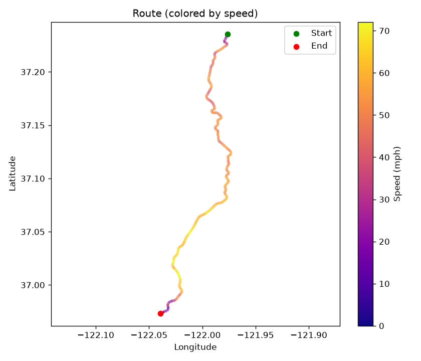
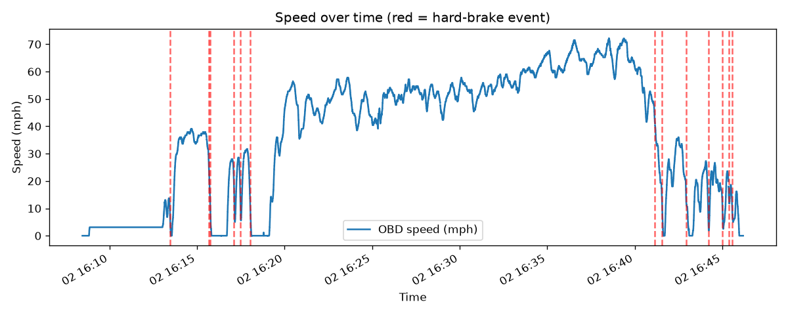
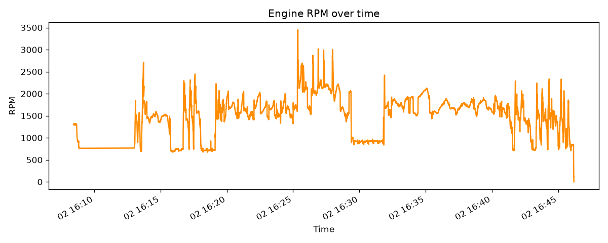
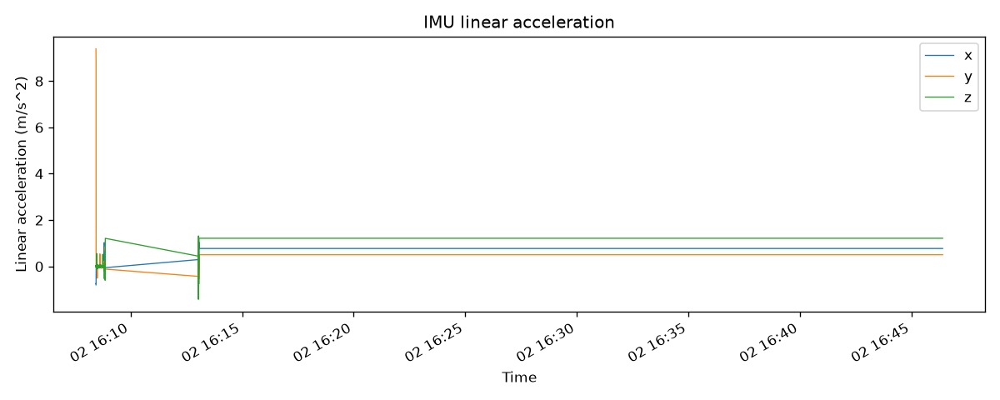

# Drive: 20260902_160823

- **Start time:** 2026-09-02T16:08:27.071617
- **Duration:** 2276 s (37.9 min)
- **Distance:** 22.14 mi
- **Max speed:** 72.1 mph
- **Max RPM:** 3453.0
- **Hard-braking events detected:** 13

## A note on this drive

About three seconds after the Pi powered on, the whole sensor assembly
fell off the dashboard mount, mid-recording. You can actually see it
in the data: the IMU logged its largest acceleration spikes of the
entire session at that exact moment (16:08:27), a burst of ~9 m/s²
readings consistent with a real fall rather than anything road-related.
The dashcam was recording at the time too, but the impact likely
knocked the camera's ribbon cable loose, since the video file never
finished writing. Everything got remounted and the actual drive picked
back up a few minutes later. Left in as an honest record of what real
hardware testing looks like.

## Route

## Speed

## RPM

## IMU Linear Acceleration

## Hard-Braking Events

### Event 1 — 2026-09-02T16:13:27.091407
Deceleration: -11.99 mph/s

### Event 2 — 2026-09-02T16:15:40.053658
Deceleration: -11.97 mph/s

### Event 3 — 2026-09-02T16:15:44.658553
Deceleration: -12.99 mph/s

### Event 4 — 2026-09-02T16:17:06.354237
Deceleration: -13.08 mph/s

### Event 5 — 2026-09-02T16:17:28.881527
Deceleration: -12.99 mph/s

### Event 6 — 2026-09-02T16:18:01.819557
Deceleration: -11.99 mph/s

### Event 7 — 2026-09-02T16:41:07.058514
Deceleration: -12.98 mph/s

### Event 8 — 2026-09-02T16:41:33.590649
Deceleration: -12.0 mph/s

### Event 9 — 2026-09-02T16:42:55.196644
Deceleration: -12.99 mph/s

### Event 10 — 2026-09-02T16:44:12.287402
Deceleration: -13.0 mph/s

### Event 11 — 2026-09-02T16:45:00.150935
Deceleration: -12.97 mph/s

### Event 12 — 2026-09-02T16:45:21.376779
Deceleration: -11.9 mph/s

### Event 13 — 2026-09-02T16:45:33.592491
Deceleration: -12.84 mph/s
