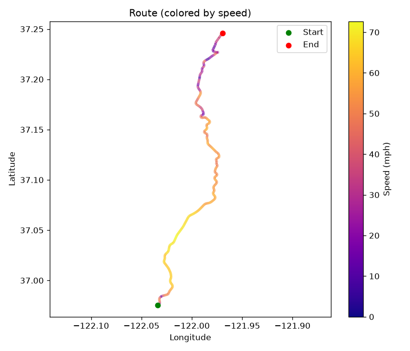
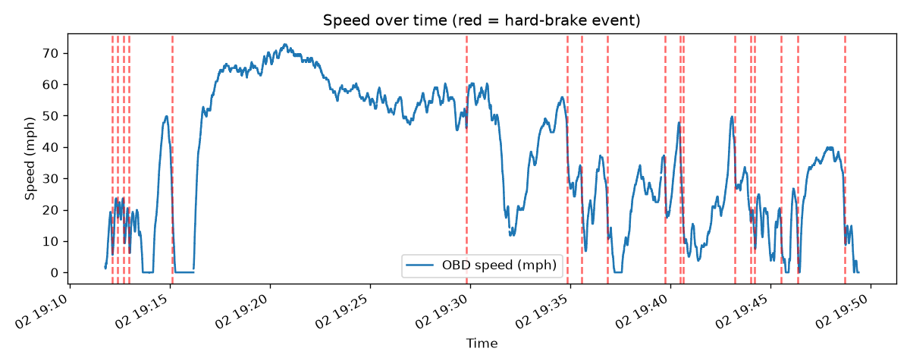
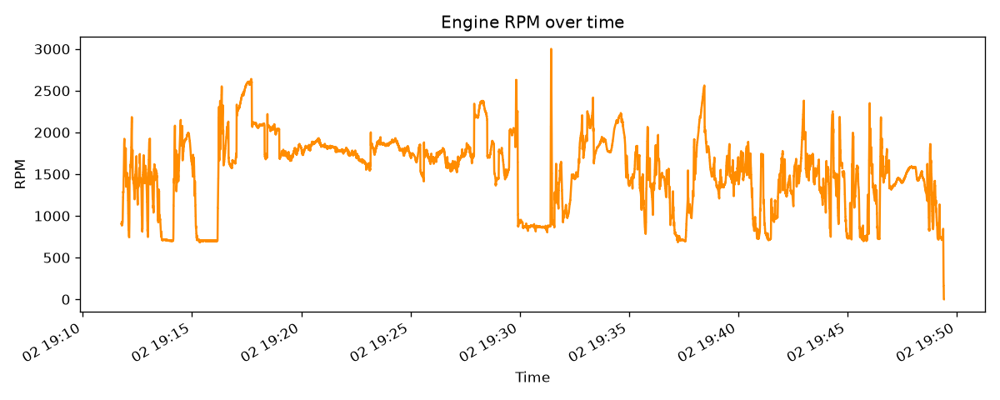
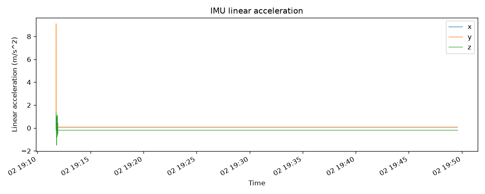

# Drive: 20260902_191142

- **Start time:** 2026-09-02T19:11:45.726223
- **Duration:** 2270 s (37.8 min)
- **Distance:** 22.76 mi
- **Max speed:** 72.7 mph
- **Max RPM:** 3002.0
- **Hard-braking events detected:** 18

## Route

## Speed

## RPM

## IMU Linear Acceleration

## Hard-Braking Events

### Event 1 — 2026-09-02T19:12:07.002982
Deceleration: -11.98 mph/s

### Event 2 — 2026-09-02T19:12:23.126057
Deceleration: -11.97 mph/s

### Event 3 — 2026-09-02T19:12:41.947225
Deceleration: -18.03 mph/s

### Event 4 — 2026-09-02T19:12:57.765198
Deceleration: -13.01 mph/s

### Event 5 — 2026-09-02T19:15:05.216697
Deceleration: -13.01 mph/s

### Event 6 — 2026-09-02T19:29:47.742496
Deceleration: -12.98 mph/s

### Event 7 — 2026-09-02T19:34:51.795223
Deceleration: -12.98 mph/s

### Event 8 — 2026-09-02T19:35:35.044955
Deceleration: -13.0 mph/s

### Event 9 — 2026-09-02T19:36:51.533744
Deceleration: -12.99 mph/s

### Event 10 — 2026-09-02T19:39:43.835093
Deceleration: -12.03 mph/s

### Event 11 — 2026-09-02T19:40:29.487728
Deceleration: -13.0 mph/s

### Event 12 — 2026-09-02T19:40:38.298711
Deceleration: -12.04 mph/s

### Event 13 — 2026-09-02T19:43:14.580925
Deceleration: -13.03 mph/s

### Event 14 — 2026-09-02T19:44:00.333635
Deceleration: -11.98 mph/s

### Event 15 — 2026-09-02T19:44:13.649523
Deceleration: -11.94 mph/s

### Event 16 — 2026-09-02T19:45:32.341876
Deceleration: -12.0 mph/s

### Event 17 — 2026-09-02T19:46:22.400953
Deceleration: -11.95 mph/s

### Event 18 — 2026-09-02T19:48:44.275566
Deceleration: -12.99 mph/s
