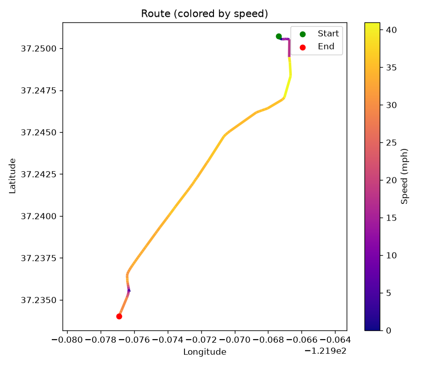
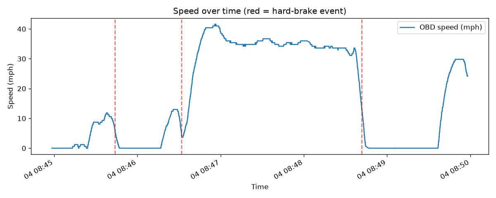
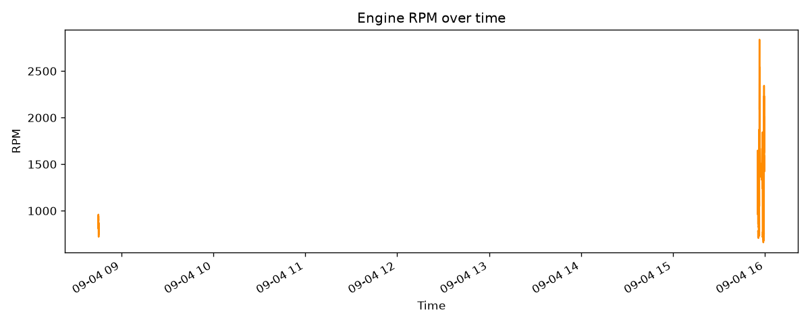
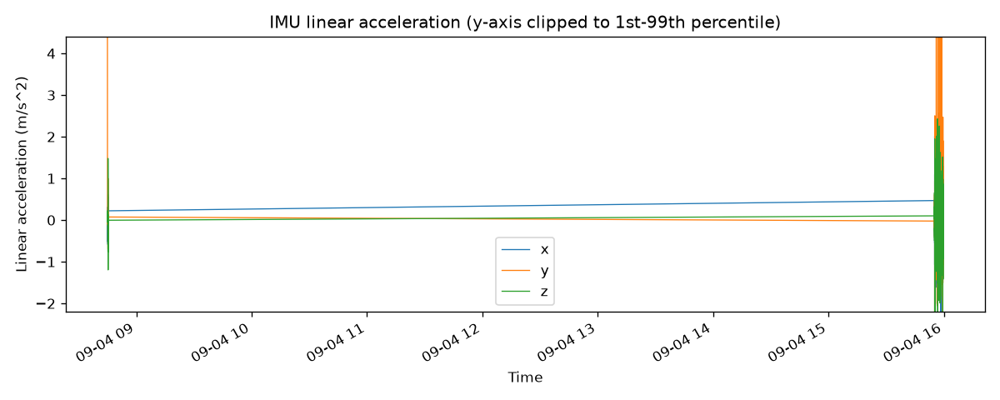

# Drive: 20260904_084455

- **Start time:** 2026-09-04T08:44:58.407604
- **Duration:** 300 s (5.0 min)
- **Distance:** 1.39 mi
- **Max speed:** 41.6 mph
- **Max RPM:** 2838.0
- **Hard-braking events detected:** 3

## Route

## EKF Sensor Fusion
_EKF fusion not yet run for this drive (see ekf_fusion.py)._

## Speed

## RPM

## IMU Linear Acceleration

## Hard-Braking Events

### Event 1 — 2026-09-04T15:55:26.772464
Deceleration: -11.98 mph/s

### Event 2 — 2026-09-04T15:56:14.649629
Deceleration: -12.99 mph/s

### Event 3 — 2026-09-04T15:58:24.504616
Deceleration: -13.01 mph/s
