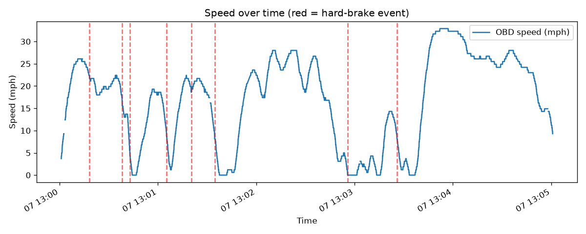
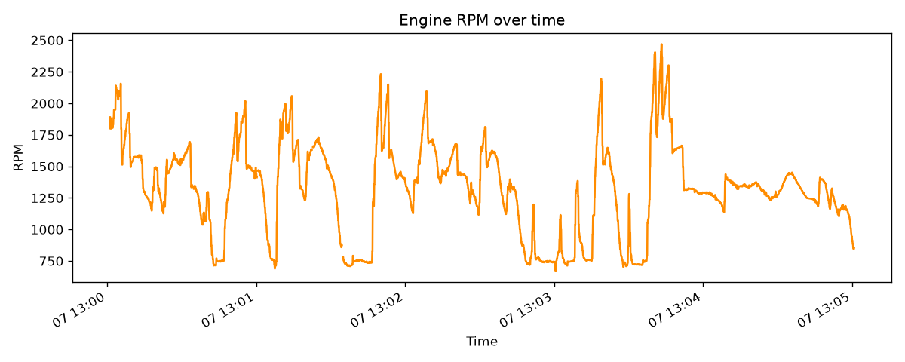
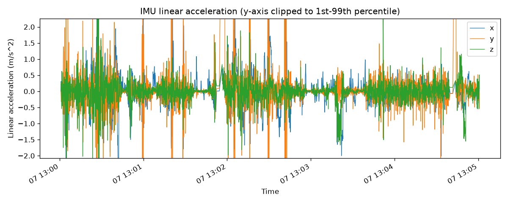

# Drive: 20260907_125957

- **Start time:** 2026-09-07T13:00:00.884907
- **Duration:** 300 s (5.0 min)
- **Distance:** 0.00 mi
- **Max speed:** 32.9 mph
- **Max RPM:** 2469.0
- **Hard-braking events detected:** 8

## Route
_No GPS route available._

## EKF Sensor Fusion
_EKF fusion not yet run for this drive (see ekf_fusion.py)._

## Speed

## RPM

## IMU Linear Acceleration

## Hard-Braking Events

### Event 1 — 2026-09-07T13:00:18.278344
Deceleration: -13.71 mph/s

### Event 2 — 2026-09-07T13:00:38.234068
Deceleration: -18.56 mph/s

### Event 3 — 2026-09-07T13:00:42.942399
Deceleration: -13.91 mph/s

### Event 4 — 2026-09-07T13:01:05.270472
Deceleration: -13.12 mph/s

### Event 5 — 2026-09-07T13:01:20.314044
Deceleration: -11.97 mph/s

### Event 6 — 2026-09-07T13:01:34.640584
Deceleration: -15.9 mph/s

### Event 7 — 2026-09-07T13:02:55.720801
Deceleration: -12.06 mph/s

### Event 8 — 2026-09-07T13:03:25.868563
Deceleration: -11.27 mph/s
