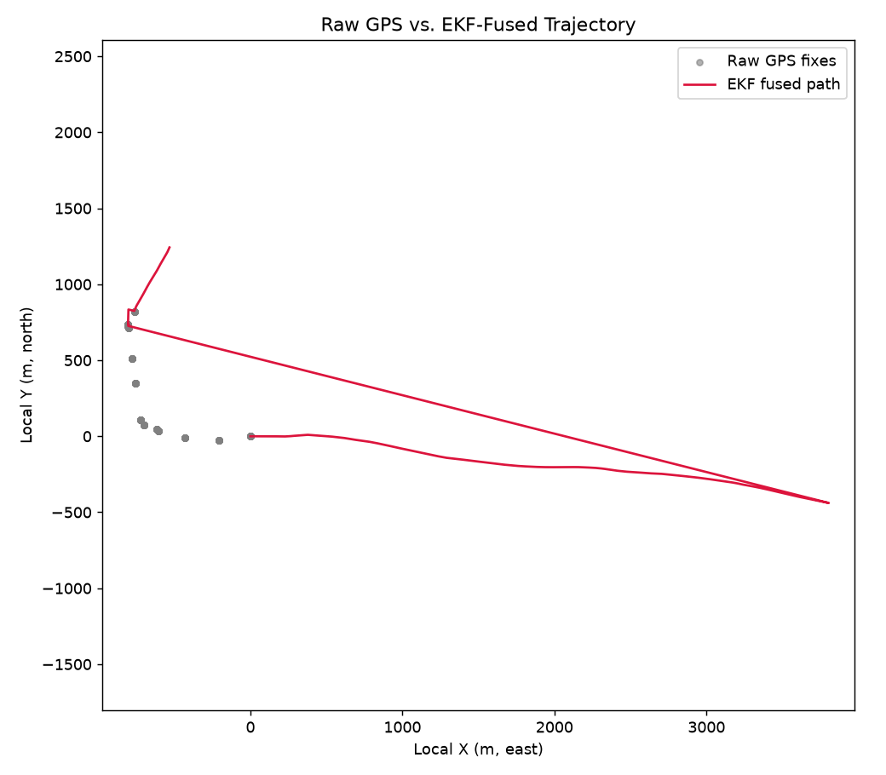
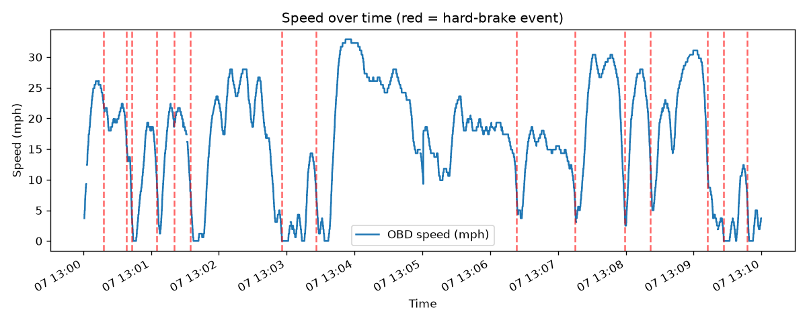
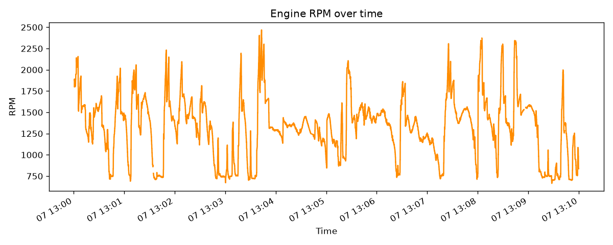
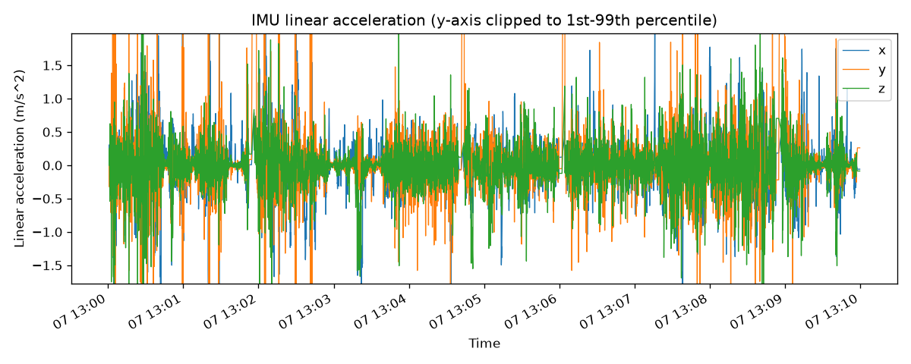

# Drive: 20260907_125957_combined

- **Start time:** 2026-09-07T13:00:00.884907
- **Duration:** 599 s (10.0 min)
- **Distance:** 0.92 mi
- **Max speed:** 32.9 mph
- **Max RPM:** 2469.0
- **Hard-braking events detected:** 15

## Route

## EKF Sensor Fusion

## Speed

## RPM

## IMU Linear Acceleration

## Hard-Braking Events

### Event 1 — 2026-09-07T13:00:18.278344
Deceleration: -13.71 mph/s

### Event 2 — 2026-09-07T13:00:38.234068
Deceleration: -18.56 mph/s

### Event 3 — 2026-09-07T13:00:42.942399
Deceleration: -13.91 mph/s

### Event 4 — 2026-09-07T13:01:05.270472
Deceleration: -13.12 mph/s

### Event 5 — 2026-09-07T13:01:20.314044
Deceleration: -11.97 mph/s

### Event 6 — 2026-09-07T13:01:34.640584
Deceleration: -15.9 mph/s

### Event 7 — 2026-09-07T13:02:55.720801
Deceleration: -12.06 mph/s

### Event 8 — 2026-09-07T13:03:25.868563
Deceleration: -11.27 mph/s

### Event 9 — 2026-09-07T13:06:23.549390
Deceleration: -12.8 mph/s

### Event 10 — 2026-09-07T13:07:15.248120
Deceleration: -12.44 mph/s

### Event 11 — 2026-09-07T13:07:59.170259
Deceleration: -14.79 mph/s

### Event 12 — 2026-09-07T13:08:21.847841
Deceleration: -13.54 mph/s

### Event 13 — 2026-09-07T13:09:11.959758
Deceleration: -13.02 mph/s

### Event 14 — 2026-09-07T13:09:26.579309
Deceleration: -12.28 mph/s

### Event 15 — 2026-09-07T13:09:47.436423
Deceleration: -12.96 mph/s
