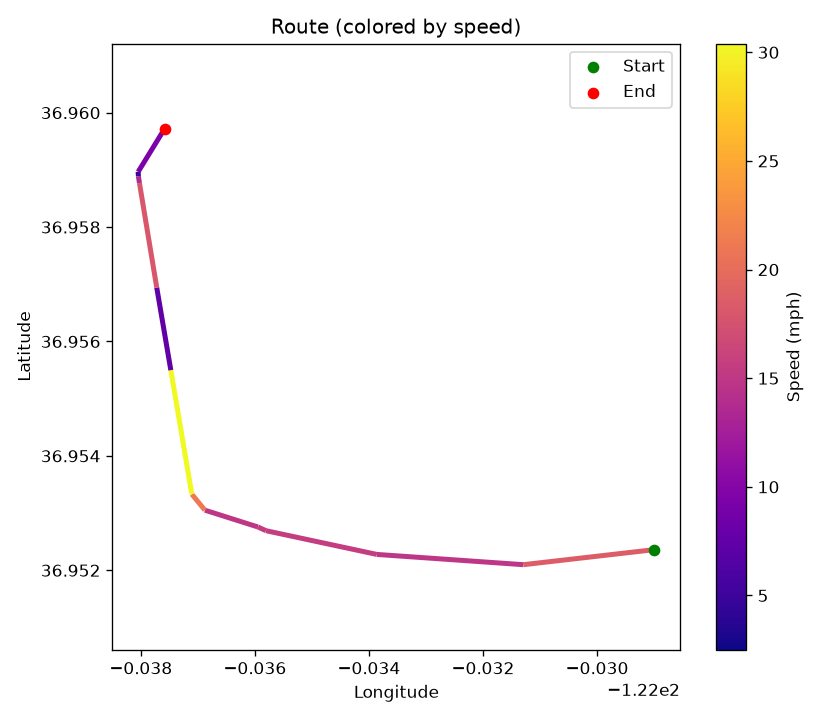
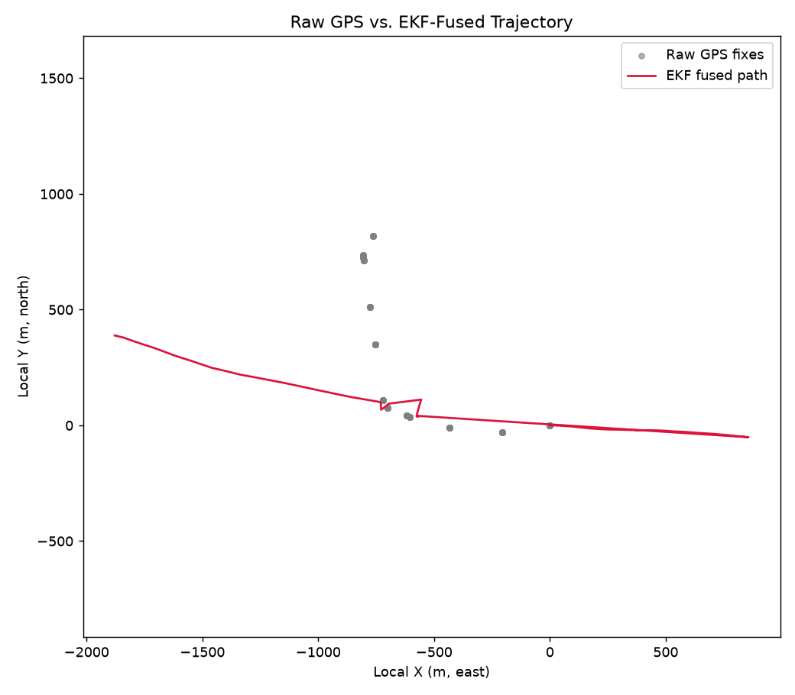
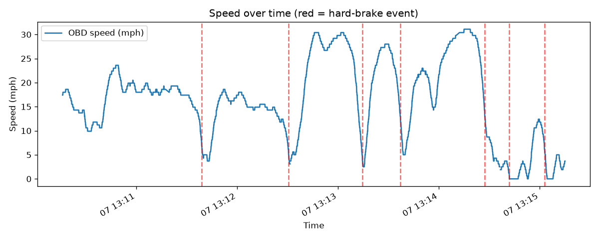
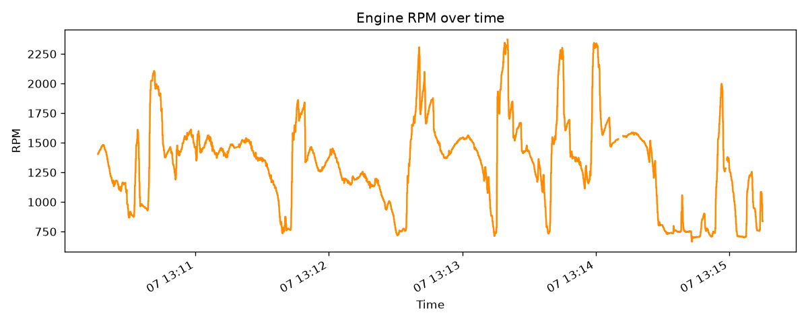
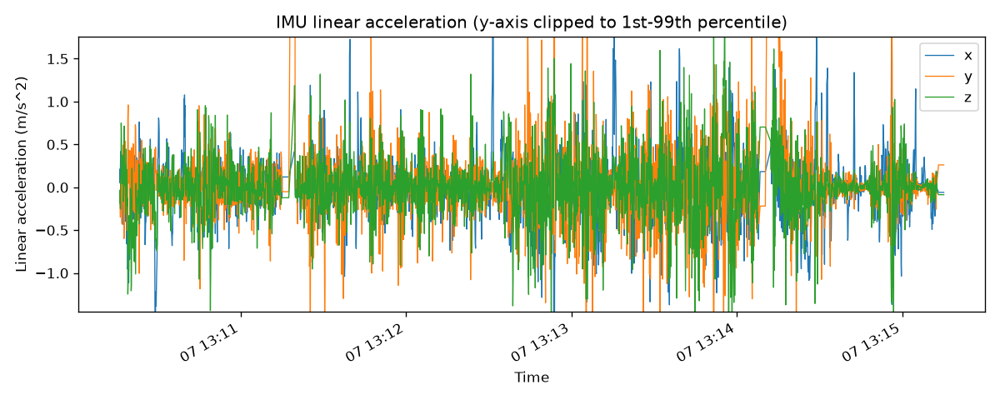

# Drive: 20260907_131012

- **Start time:** 2026-09-07T13:10:16.230751
- **Duration:** 299 s (5.0 min)
- **Distance:** 0.92 mi
- **Max speed:** 31.1 mph
- **Max RPM:** 2372.0
- **Hard-braking events detected:** 7

## Route

## EKF Sensor Fusion

## Speed

## RPM

## IMU Linear Acceleration

## Hard-Braking Events

### Event 1 — 2026-09-07T13:11:38.933640
Deceleration: -12.8 mph/s

### Event 2 — 2026-09-07T13:12:30.632370
Deceleration: -12.44 mph/s

### Event 3 — 2026-09-07T13:13:14.554509
Deceleration: -14.79 mph/s

### Event 4 — 2026-09-07T13:13:37.232091
Deceleration: -13.54 mph/s

### Event 5 — 2026-09-07T13:14:27.344008
Deceleration: -13.02 mph/s

### Event 6 — 2026-09-07T13:14:41.963559
Deceleration: -12.28 mph/s

### Event 7 — 2026-09-07T13:15:02.820673
Deceleration: -12.96 mph/s
