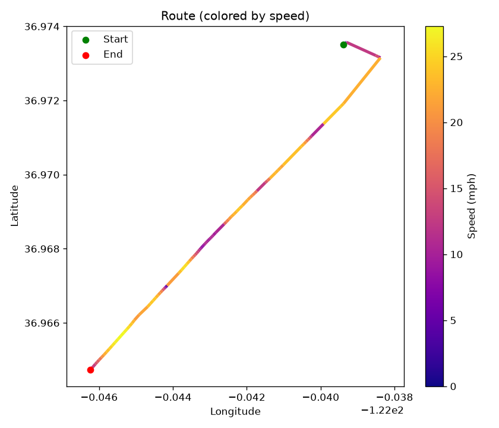
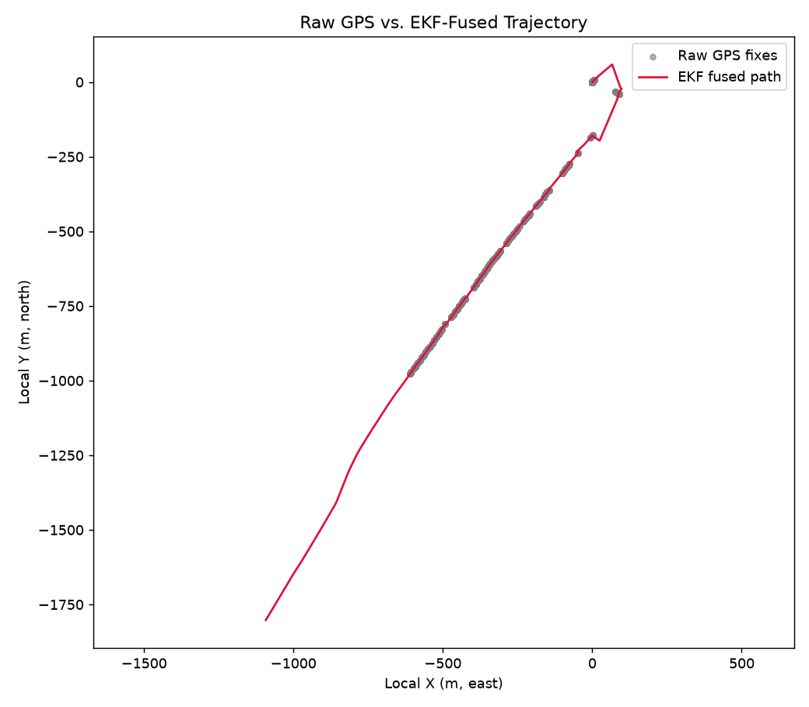
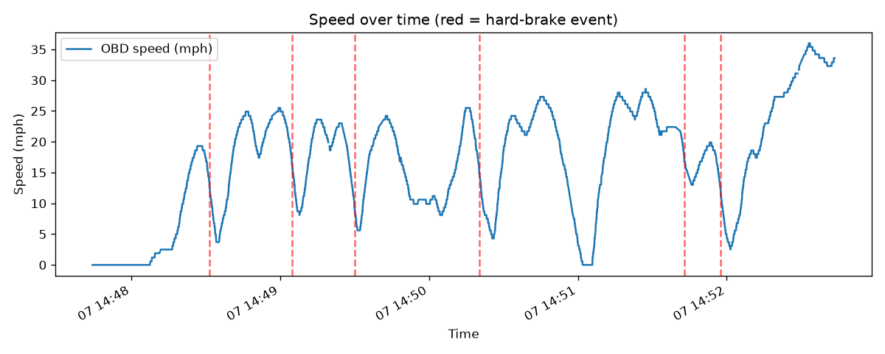
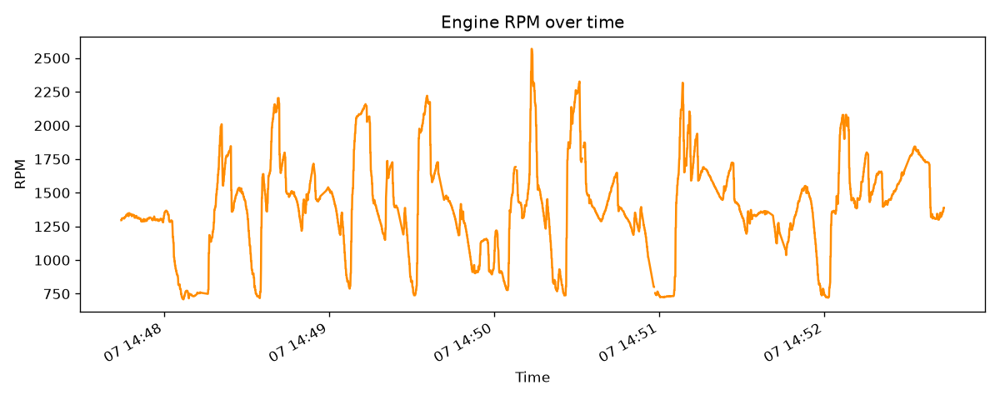
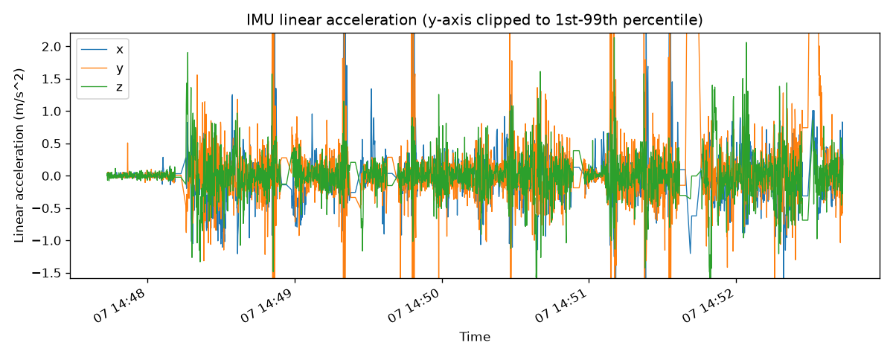

# Drive: 20260907_144740

- **Start time:** 2026-09-07T14:47:43.535745
- **Duration:** 300 s (5.0 min)
- **Distance:** 0.79 mi
- **Max speed:** 36.0 mph
- **Max RPM:** 2569.0
- **Hard-braking events detected:** 6

## Route

## EKF Sensor Fusion

## Speed

## RPM

## IMU Linear Acceleration

## Hard-Braking Events

### Event 1 — 2026-09-07T14:48:31.529556
Deceleration: -13.0 mph/s

### Event 2 — 2026-09-07T14:49:04.724047
Deceleration: -12.05 mph/s

### Event 3 — 2026-09-07T14:49:29.894384
Deceleration: -12.45 mph/s

### Event 4 — 2026-09-07T14:50:20.196575
Deceleration: -13.49 mph/s

### Event 5 — 2026-09-07T14:51:42.861170
Deceleration: -11.96 mph/s

### Event 6 — 2026-09-07T14:51:57.593783
Deceleration: -13.04 mph/s
