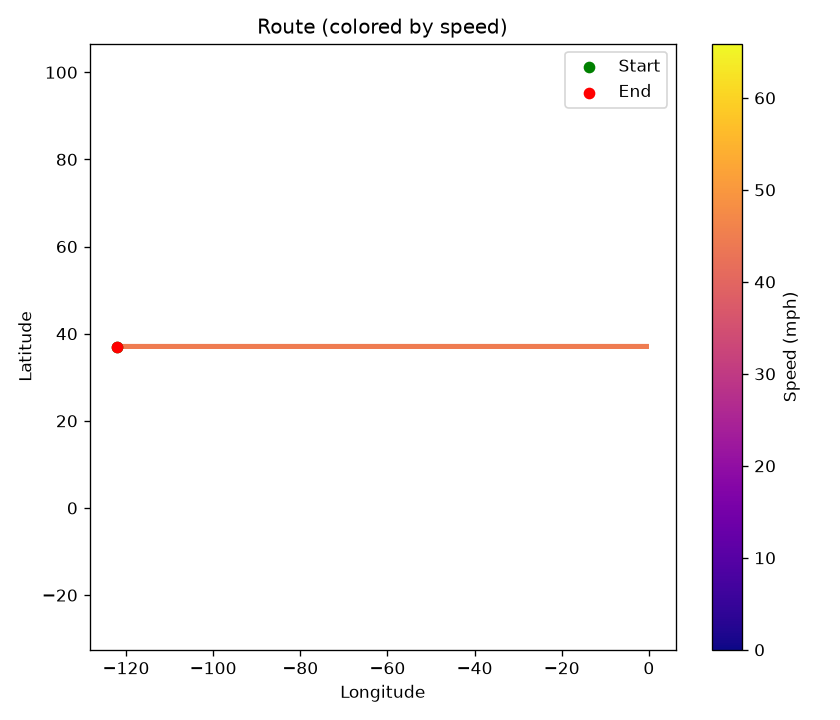
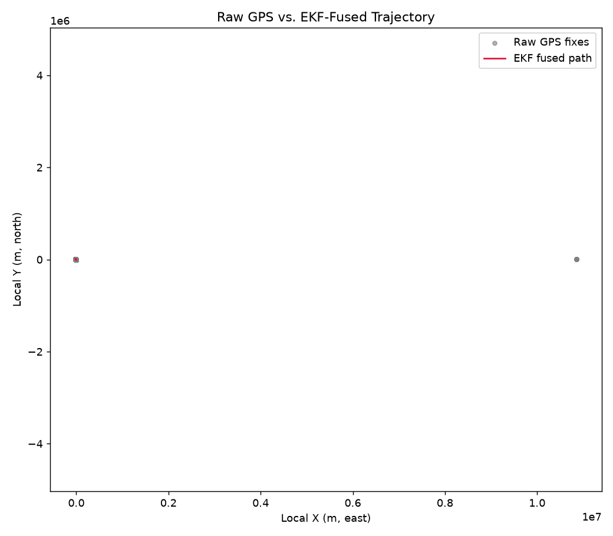
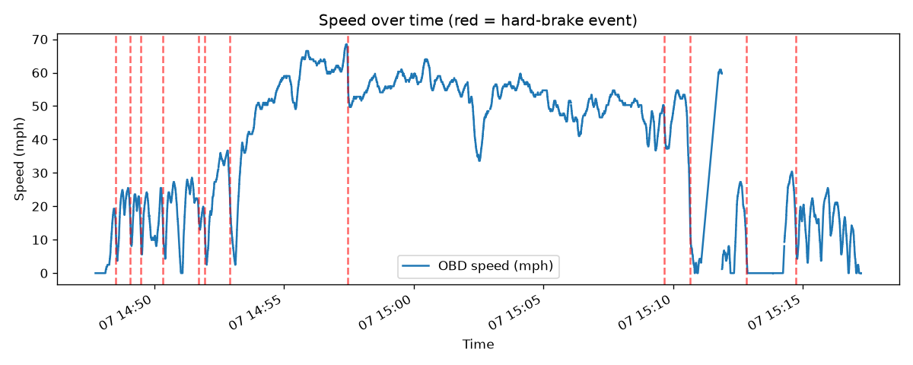
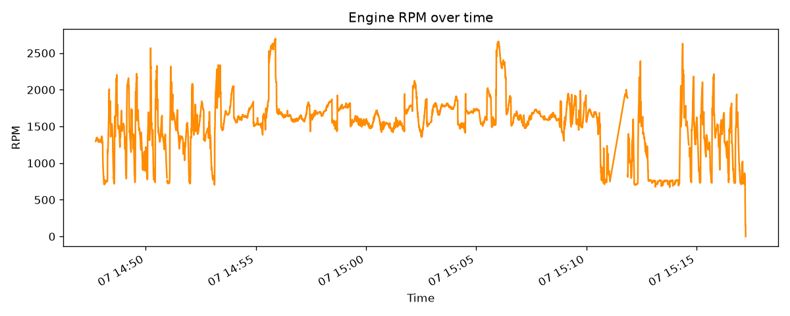
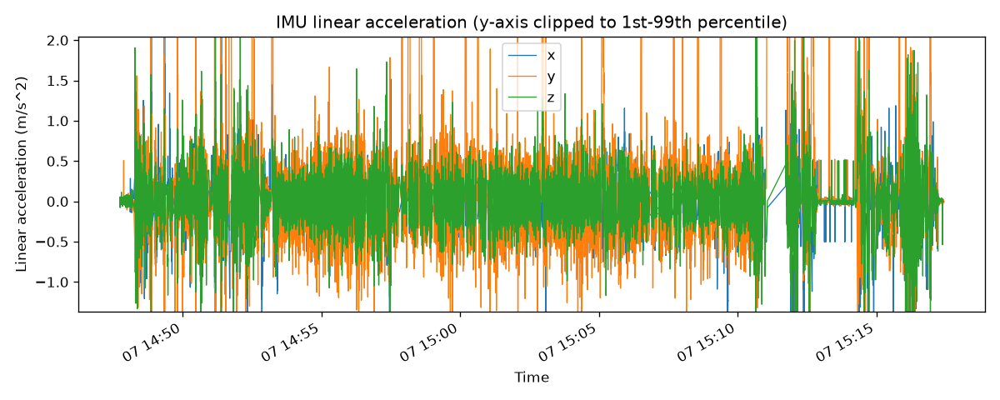

# Drive: 20260907_144740_combined

- **Start time:** 2026-09-07T14:47:43.535745
- **Duration:** 1782 s (29.7 min)
- **Distance:** 12280.63 mi
- **Max speed:** 68.4 mph
- **Max RPM:** 2698.0
- **Hard-braking events detected:** 12

## Route

## EKF Sensor Fusion

## Speed

## RPM

## IMU Linear Acceleration

## Hard-Braking Events

### Event 1 — 2026-09-07T14:48:31.529556
Deceleration: -13.0 mph/s

### Event 2 — 2026-09-07T14:49:04.724047
Deceleration: -12.05 mph/s

### Event 3 — 2026-09-07T14:49:29.894384
Deceleration: -12.45 mph/s

### Event 4 — 2026-09-07T14:50:20.196575
Deceleration: -13.49 mph/s

### Event 5 — 2026-09-07T14:51:42.861170
Deceleration: -11.96 mph/s

### Event 6 — 2026-09-07T14:51:57.593783
Deceleration: -13.04 mph/s

### Event 7 — 2026-09-07T14:52:55.333833
Deceleration: -12.98 mph/s

### Event 8 — 2026-09-07T14:57:27.613941
Deceleration: -19.0 mph/s

### Event 9 — 2026-09-07T15:09:39.626315
Deceleration: -16.44 mph/s

### Event 10 — 2026-09-07T15:10:38.881935
Deceleration: -18.87 mph/s

### Event 11 — 2026-09-07T15:12:48.189092
Deceleration: -13.12 mph/s

### Event 12 — 2026-09-07T15:14:43.980125
Deceleration: -12.91 mph/s
